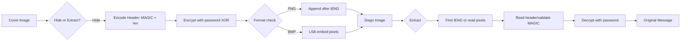
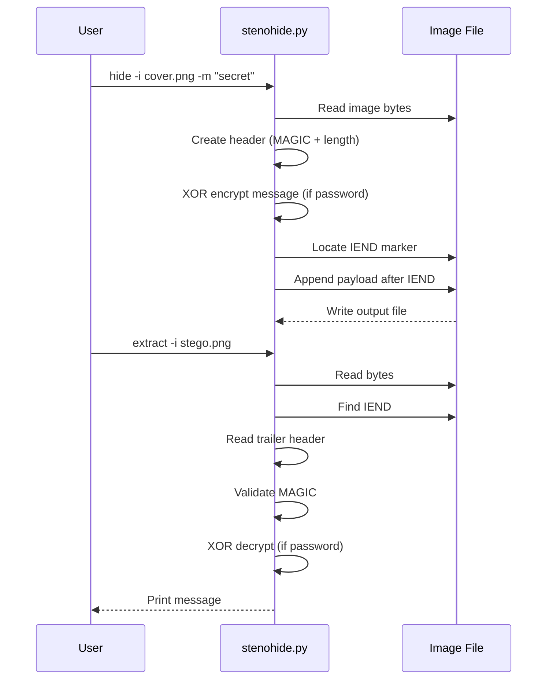

# StenoHide

Image-based steganography tool. Hide and extract data in PNG/JPG using LSB techniques. Simple, no frills.

Two modes:
- **Trailer mode** (PNG): appends payload after IEND chunk — parsers ignore it
- **LSB pixel mode** (BMP): embeds in least significant bits of RGB channels

## Quick Start

```bash
# Hide a message in a PNG (trailer mode)
python3 stenohide.py hide -i cover.png -m "s3cr3t" -o out.png

# Extract from trailer
python3 stenohide.py extract -i out.png

# With XOR password
python3 stenohide.py hide -i cover.png -m "classified" -p "hunter2" -o out.png
python3 stenohide.py extract -i out.png -p "hunter2"

# LSB pixel mode (BMP only)
python3 stenohide.py hide -i cover.bmp -m "hidden" --lsb -o stego.bmp
python3 stenohide.py extract -i stego.bmp --lsb
```

## How It Works



## Architecture



## Known Issues

- LSB pixel mode only works with BMP. PNG uses deflate compression — pixel data isn't contiguous.
- Trailer mode is detectable (appends data, changes file hash). Stegoanalysis will flag it.
- XOR encryption is basic. Not real crypto — keeps honest people honest.
- Large messages in LSB mode corrupt the image noticeably.

## TODO

- [ ] Real AES encryption instead of XOR
- [ ] .WAV audio support
- [ ] LSB mode for PNG (requires deflate re-compression)
- [ ] Embed in EXIF metadata as alternative

## License

MIT
